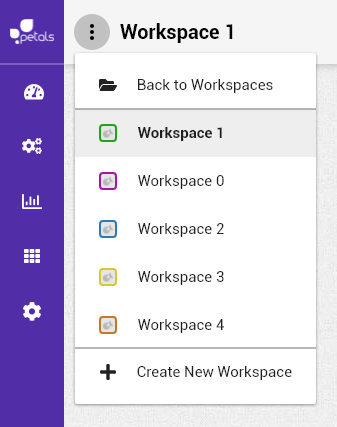

# IHM

## Charte Graphique

Les éléments suivants constituent la charte graphique.

En cas de conflit entre la charte graphique préconisée et celle ci-dessous, c'est cette dernière qui domine. En effet, elle a été définie avec les besoins des utilisateurs \(**Petals**\) en tête.

* L'application doit occuper toute la largeur de l'écran. Pas de largeur fixe.
* Le design est réfléchi de manière à s'ajuster et s'adapter aux appareils de type ordinateur de table \(desktop\) ou tablette \(touch pad\). En suivant l'approche de conception _"desktop-first"_, l'interface d'un mobile n'est pas entièrement prise en charge.
* La taille minimale \(résolution\) de la zone d'affichage \(à l'intérieur du navigateur web\) est définie à 960 pixels de large \(par 540 pixels de haut\) les largeurs correspondent à md, lg et xl sur [flex layout](https://github.com/angular/flex-layout/wiki/Responsive-API#mediaqueries-and-aliases) et à small-tablet \(la plus grande taille de small\), medium, large et xlarge sur [material design](https://material.io/design/layout/responsive-layout-grid.html#breakpoints). Au dessous de cette taille, l'application peut avoir des problèmes d'affichage.
* Le menu doit être accessible à tout instant depuis un espace de travail ouvert, y compris quand la page devient très grande.
* Les couleurs importantes de cockpit sont le violet \(primaire\), le orange \(secondaire\) et le blanc. En complément, les couleurs acceptées sont le rouge \(erreur\), le bleu \(information\), le vert \(succès\) et le gris.

## Elements de l'interface

* L'application affichera image marketing \(logo\) de Petals ESB qui devra être toujours visible.
  * Le logo n'est pas cliquable.

* Une **barre de navigation latérale** appelée "**sidebar**" qui prend toute la hauteur sur la partie gauche et qui sert avant tout de barre de navigation principale pour cockpit. 
  * Accès aux vues Topologie, Services, Consoles et Api \(espace de travail ouvert\).
  * Accès à la vue administration \(réservé aux administrateurs\)
  * Accès à la vue préférences \(utilisateur est connecté\)
  * Se déconnecter \(utilisateur est connecté\)

* Une **barre de navigation horizontale** appelée "**header**" sur la partie haute et qui sert de menu pour l'espace de travail ouvert.
  * Propose une icone de notifications à droite \(désactivée pour le moment\).
  * Ne propose pas d'actions, uniquement des informations et redirections.
  * Affiche à gauche un icone "elipsis"  ouvrant un menu déroulant qui permet de:
    * retourner à la liste des espaces
    * charger un espace auquel on à accès
    * visualiser l'espace courant
    * aller à la page de création d'espace
  * Affiche un "**fil d’ariane**" permettant de savoir où l'on se trouve sur le site, et où se trouve l'élément en train d'être visionné \(par exemple: la hiérarchie de l'artefact dans la topologie\)
    * Le contenu exact du "**fil d'ariane**" sera précisé dans chacune des vues.
    * Chaque élément du fil est cliquable pour accéder au détail de l'élément.

* les différentes vues principales lorsqu'un espace de travail est ouvert \(détail en section tâches\) :
  * **vue topologie** : sert à visualiser et effectuer des actions sur une topologie et chacun de ses éléments. L'exploration est facilitée par un volet de navigation représentant la topologie sous forme d'arbre et une zone contextuelle à chaque élément.
  * **vue services** : permet de visualiser la liste des services des bus du workspace à l'aide d'un volet de navigation.
  * **vue api** \(à définir\)
  * **vue consoles** \(à définir\)
* Une page d'administration \(nécessite les droits administrateur\):
  * ajouter/supprimer les utilisateurs cockpit \(versions LDAP et non LDAP\)
* Une page de préférences utilisateur
  * Themes \(à déterminer\) 

Plus globalement, la logique du site doit être la suivante :

* On part d'un espace de travail, toujours. C'est la page d'accueil d'un espace ouvert.
* On consulte une topologie. On navigue dans l'arbre.
* On descend d'un niveau pour arriver au conteneur.
* On descend encore d'un niveau pour arriver aux artefacts.

Dans cette logique, l'arbre du volet de navigation aide à se situer et à remonter d'un ou plusieurs niveaux. Toutefois, l'utilisateur a la possibilité de passer par le contenu du site pour consulter les parents ou enfants d'un élément sélectionné ou bien par le fil d'ariane. De plus, cette approche coïncide \(volontairement\) avec la logique de fonctionnement et de distribution de Petals.

