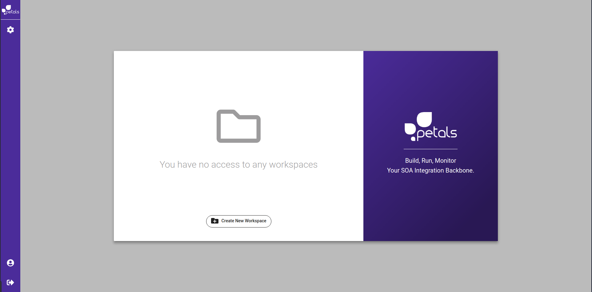
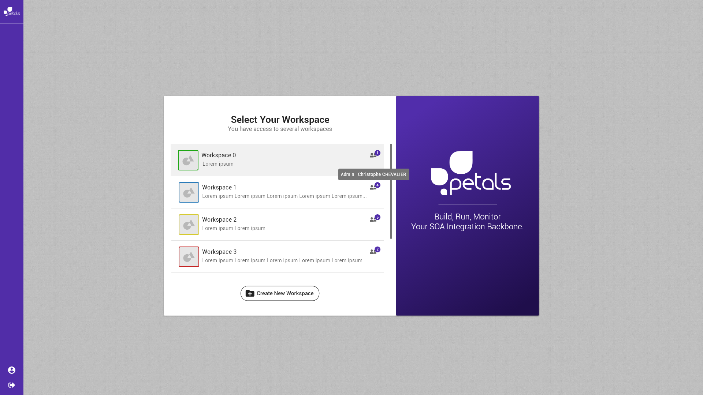

# Ouvrir un espace de travail

Concepts associés : un **Espace de Travail**.  
Préconditions : [\[ Se connecter \]](se-connecter.md)  
Postconditions : [\[ Visualiser un Espace de Travail \]](visualiser-un-espace-de-travail.md)  
Contraintes : -  
Complexité : -

### Scénarios


Dans un scénario, on ne mentionne pas les actions techniques \(pas de clic, de tooltip, etc\).


**Scénario normal :** Albert veut sélectionner un espace de travail pour travailler. Plusieurs sont listés. Il sélectionne celui qui s'appelle **pre-prod** et valide son choix.   
  
**Scénario alternatif 1 :** Albert veut sélectionner un espace de travail pour travailler. Aucun n'est listé. Il peut donc soit [créer un nouvel espace de travail](definir-un-espace-de-travail.md), soit [se déconnecter](se-deconnecter.md).   
  
**Scénario alternatif 2 :** Albert veut sélectionner un espace de travail pour travailler. Plusieurs sont listés. Il sélectionne celui qui s'appelle **pre-prod** mais ne peut valider son choix. En effet, il n'a pas les droits suffisants. Il peut toutefois récupérer le nom de l'administrateur de cet espace pour prendre contact avec lui.

### Maquette illustrative

### Informations complémentaires pour implémentation

* La sélection d'un espace de travail se fait par simple clic sur la zone qui lui est dédiée dans la liste.
* Survoler la zone description permet d'afficher un _tooltip_ avec la description intégrale de l'espace.
* Survoler l'icône utilisateurs permet d'afficher un _tooltip_ avec le nom de son ou ses administrateurs. 
* La liste des espaces est triée. Ceux auquels l'utilisateur a accès sont listés en premier. Les autres viennent après. Un badge est attaché à chaque espace de travail indiquant le nombre de personnes y ayant accès.
* Une icône \(ou un fond de couleur différente\) marque différemment les espaces auxquels l'utilisateur n'a pas accès.


Pour l'instant, l'utilisateur ne voit que les espaces de travail auquels il peut accéder. Le survol du badge indique le nom de tout les utilisateurs de l'espace de travail et la notion d'administrateur ainsi que les droits d'accès sera implémentées plus tard.


