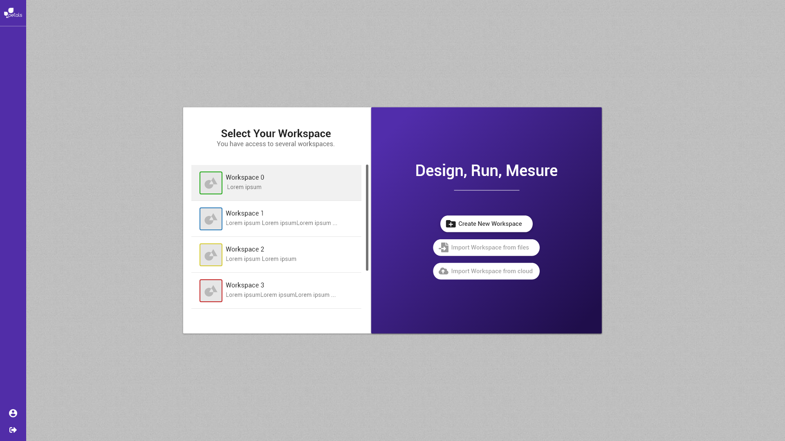

# Charger un espace de travail


La notation suivante est prise :


* \[ tâche \] fait référence à une autre tâche.
* Action \(sans crochets\) fait référence à une action utilisateur.

Concepts associés : un **Espace de Travail**.  
Préconditions : [\[ Définir un Espace de Travail \]](definir-un-espace-de-travail.md)  
Postconditions : -  
Contraintes : -  
Complexité : -

Beber a accès à un ou plusieurs espaces de travail donc il arrive sur la vue où se trouve la liste des espaces de travail.  

Beber clique sur un espace de travail dans la liste et il est redirigé vers son [espace de travail](visualiser-un-espace-de-travail.md).

