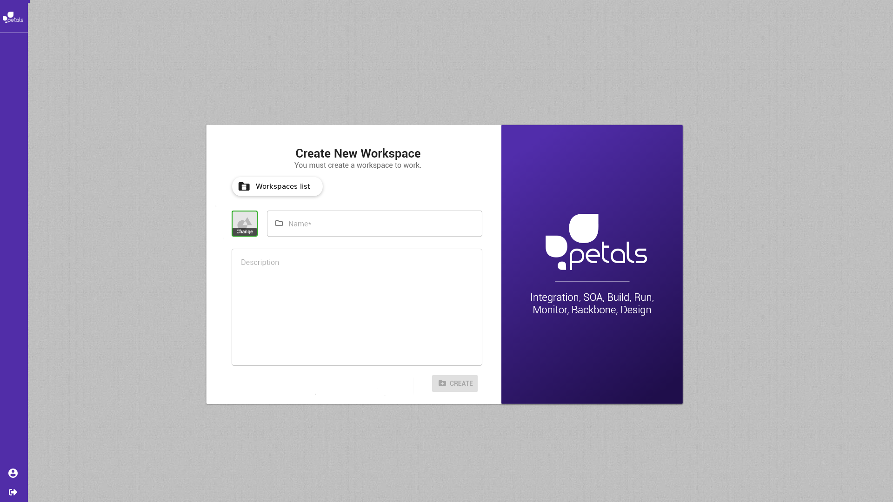
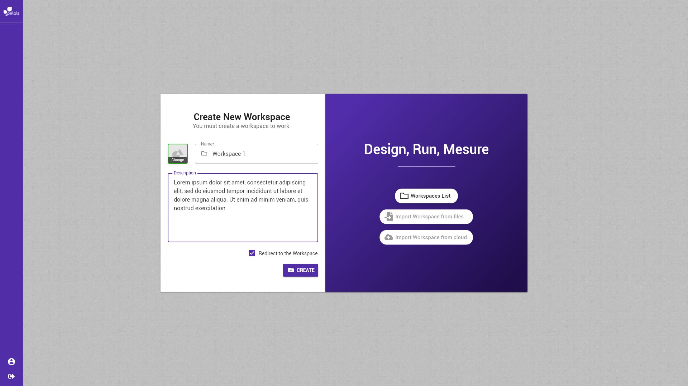

# Créer un espace de travail


La notation suivante est prise :


* \[ tâche \] fait référence à une autre tâche.
* Action \(sans crochets\) fait référence à une action utilisateur.

Concepts associés : un **Espace de Travail**.  
Préconditions : [\[ Se Connecter \]](se-connecter.md)  
Postconditions : -  
Contraintes : -  
Complexité : -  
  
Beber n'a pas encore d'accès à un espace de travail:

Beber clique sur _Create workspace_ et est redirigé sur la vue de création d'un espace de travail: 

Tous les champs sont vides par défaut. Beber renseigne pour son espace de travail :

* Un _nom,_ obligatoire 
* Une _description,_ optionnelle

Le bouton _create_ s'active et Beber clique dessus pour créer son espace de travail, il est redirigé sur l'espace de travail créé.

