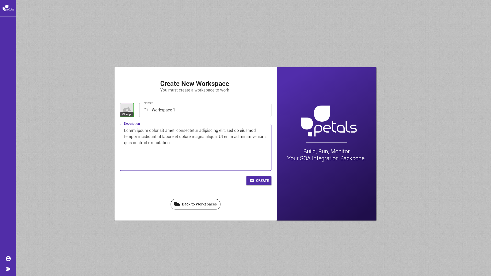
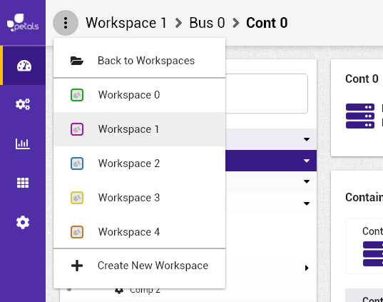

# Créer un espace de travail


La notation suivante est prise :


* \[ tâche \] fait référence à une autre tâche.
* Action \(sans crochets\) fait référence à une action utilisateur.

Concepts associés : un **Espace de Travail**.  
Préconditions : [\[ Se connecter \]](se-connecter.md)  [\[ Charger un espace de travail \]](charger-un-espace-de-travail.md)  
Postconditions : [\[ Visualiser un Espace de Travail \]](visualiser-un-espace-de-travail.md)  
Contraintes : -  
Complexité : -  

### Scénarios


Dans un scénario, on ne mentionne pas les actions techniques \(pas de clic, de tooltip, etc\).


**Scénario normal :** Albert veut créer un espace de travail pour travailler. Donne un nom \(et optionnellement une description\) pour le nouvel espace et valide son choix. Il est redirigé vers l'espace créé.

**Scénario alternatif:** Albert voulait créer un espace de travail, mais change d'avis. Il retourne sur la selection des espaces.

**Scénario alternatif 2:**  Albert est déjà connecté à un espace de travail, il accède à la page de création d'espace à l'aide du menu déroulant. suite : **scénario normal.**

\*\*\*\*

### Maquette illustrative

### Informations complémentaires pour implémentation

* Tous les champs sont vides par défaut. 
* Le champ _nom_ est obligatoire.
* Le champ _description courte_ est optionnel.
* Le menu déroulant n'est accessible qu'une fois un espace chargé.


L'importation d'une image pour son espace de travail à sa création sera développé probablement après le refactor des vues.


