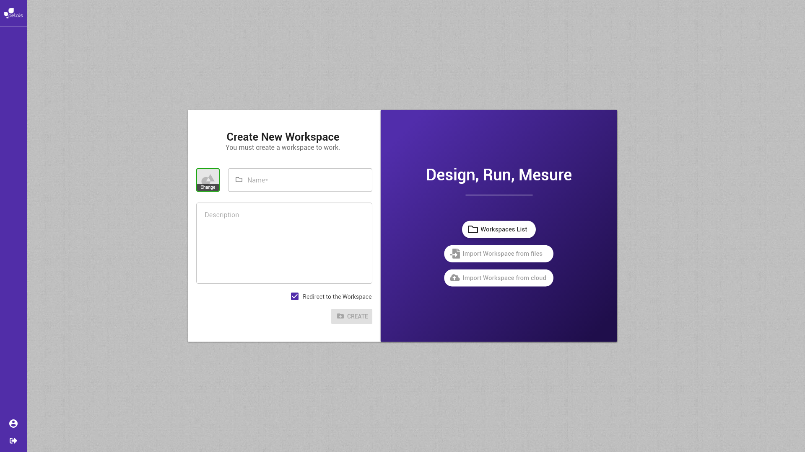

# Créer un espace de travail


La notation suivante est prise :


* \[ tâche \] fait référence à une autre tâche.
* Action \(sans crochets\) fait référence à une action utilisateur.

Concepts associés : un **Espace de Travail**.  
Préconditions : [\[ Se Connecter \]](se-connecter.md)  
Postconditions : -  
Contraintes : -  
Complexité : -  
  
Beber n'a pas encore d'accès à un espace de travail donc Beber est redirigé sur la vue de création d'un espace de travail. 


Les boutons _Import workspace from files_ et _Import workspace from cloud_ correspondent à des fonctionnalités inexistantes à l'heure actuelle et ne serons donc pas présents dans la vue.


Tous les champs sont vides par défaut. La case _redirection_ est cochée par défaut, elle peut être décochée. Beber renseigne pour son espace de travail :

* Un _nom,_ obligatoire 
* Une _description,_ optionnelle

Le bouton _create_ s'active et Beber clique dessus crée son espace de travail. 

* Si la case _redirection_ **est** cochée, il est redirigé sur l'espace de travail créé.
* Si la case _redirection_ **n'est pas** cochée, il est redirigé vers la [liste des espaces](selectionner-un-espace-de-travail.md).

