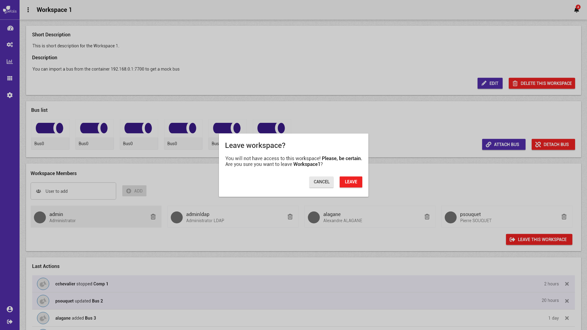

# Quitter le groupe de l'espace de travail

Concepts associés : un **Espace de Travail**.  
Préconditions : [\[ Se Connecter \]](se-connecter.md) [\[ Ouvrir un espace de travail \]](charger-un-espace-de-travail.md)  
Postconditions : -  
Contraintes : -  
Complexité : -


"Quitter le groupe" de l'espace de travail revient à se retirer les accès à l'espace de travail courant. A la fin de l'action, l'utilisateur ne fera plus partie des membres aillant accès à l'espace de travail.


### Scénario

**Scénario normal:** Albert ne veut plus avoir accès à l'espace de travail **prod.** Depuis la vue détail de l'espace en question, il se retire des membres aillant accès à l'espace après avoir confirmé. Il est déconnecté de l'espace de travail courant et est redirigé vers la page de sélection d'un espace de travail. Il n'aura plus accès à cette espace de travail.

### Maquettes

