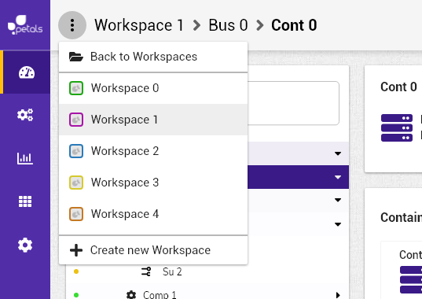

# Fermer un espace de travail


La notation suivante est prise :


* \[ tâche \] fait référence à une autre tâche.
* Action \(sans crochets\) fait référence à une action utilisateur.

Concepts associés : un **Espace de Travail**.  
Préconditions : [\[ Ouvrir un Espace de Travail \]](charger-un-espace-de-travail.md)  
Postconditions : -  
Contraintes : -  
Complexité : -


"Fermer" un espace de travail signifie s'en déconnecter. A la fin de l'action, l'espace de travail n'est pas impacté et l'utilisateur fait toujours partie des membres y aillant accès.


### Scénario

**scénario normal:** Albert veut quitter son espace de travail, il ouvre le menu déroulant et retourne à la page de selection d'espaces.

### Maquettes

### Remarque

* Le texte du bouton sera "Workspaces list" et non "back to workspaces" comme dans la maquette.
* Il n'y a pas de demande de confirmation pour quitter l'espace.

