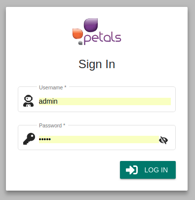
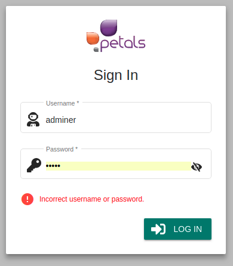

# Se connecter


La notation suivante est prise :


* \[ tâche \] fait référence à une autre tâche.
* Action \(sans crochets\) fait référence à une action utilisateur.

Concepts associés : l'application elle-même, pas vraiment un concept.  
Préconditions : -  
Postconditions :[ \[ Charger un espace de travail \]](charger-un-espace-de-travail.md)  
Contraintes : -  
Complexité : -

### Scénarios

**Scénario normal**:  Albert rentre son nom et son mot de passe. Il est enregistré en tant qu'utilisateur et est donc connecté et redirigé vers la page [Charger un espace de travail ](charger-un-espace-de-travail.md)

**Scénario normal \(LDAP\):** Albert rentre son nom et son mot de passe. Le mode LDAP est configuré dans cockpit et Albert est enregistré dans le LDAP en tant qu'utilisateur cockpit; il est donc connecté et redirigé vers la page [Charger un espace de travail](charger-un-espace-de-travail.md). 

**Scénario alternatif**: Albert rentre son nom et son mot de passe. Il n'est pas enregistré en tant qu'utilisateur \(ou bien son mot de passe est incorrect\), une erreur est affichée et il reste sur la page de connection. 

### Maquettes

  

### Informations complémentaires pour implémentation

* Le mode de connection LDAP est paramétrable par fichier de configuration au niveau du _backend_ de cockpit.

