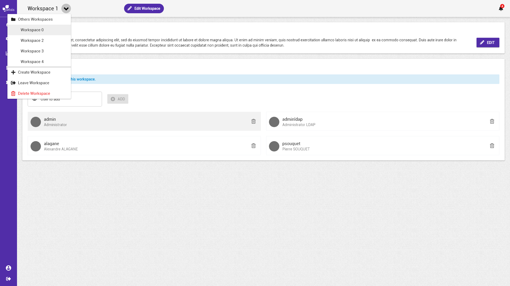

# Supprimer un espace de travail


La notation suivante est prise :


* \[ tâche \] fait référence à une autre tâche.
* Action \(sans crochets\) fait référence à une action utilisateur.

Concepts associés : un **Espace de Travail**.  
Préconditions : [\[ Charger un Espace de Travail \]](charger-un-espace-de-travail.md)  
Postconditions : -  
Contraintes : -  
Complexité : -

### Scénarios


Dans un scénario, on ne mentionne pas les actions techniques \(pas de clic, de tooltip, etc\). 


**Scénario normal :** Albert veut supprimer son espace de travail. Il ouvre le menu du workspace, et sélectionne **Delete Workspace**. Cette action requiert une confirmation de suppression. Il confirme puis il est redirigé automatiquement vers la liste des espaces de travail. 

**Scénario alternatif 1 :** Albert veut annuler la suppression de son espace de travail. Il ouvre le menu du workspace, et sélectionne **Delete Workspace**. Il annule la suppression en cours de validation.

### Maquette illustrative 

  

 

### Remarque

**Leave Workspace** ne sert plus à rien.

