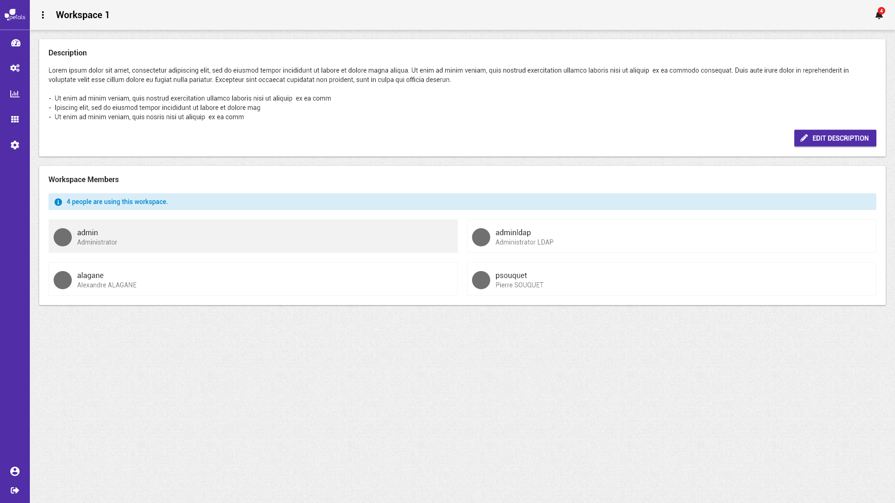

# Visualiser un espace de travail


La notation suivante est prise :


* \[ tâche \] fait référence à une autre tâche.
* Action \(sans crochets\) fait référence à une action utilisateur.

Concepts associés : un **Espace de Travail**.  
Préconditions : [\[ Se Connecter \]](se-connecter.md) [\[ Charger un espace de travail \]](charger-un-espace-de-travail.md)  
Postconditions : -  
Contraintes : -  
Complexité : -

### Maquettes

### Remarque

Pour visualiser un espace, l'utilisateur peut :

* Le sélectionner depuis la vue [\[ Charger un espace de travail \]](charger-un-espace-de-travail.md).
* Le sélectionner depuis le menu déroulant.
* Lorsqu'il est connecté, cliquer sur le nom de l'espace de travail dans le fil d'Ariane.

