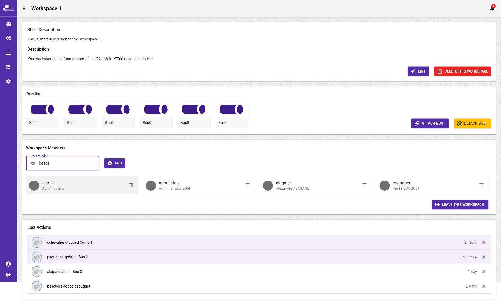
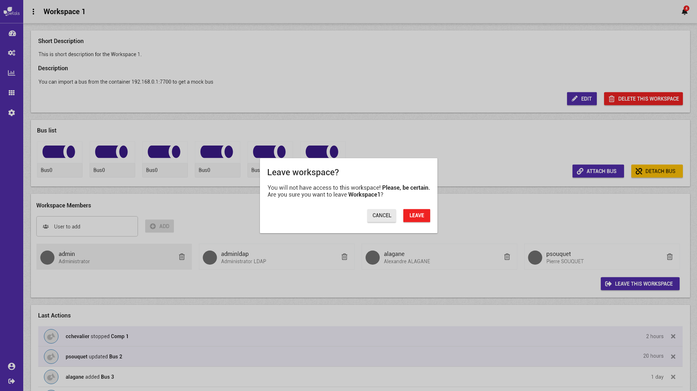

# Visualiser un espace de travail


La notation suivante est prise :


* \[ tâche \] fait référence à une autre tâche.
* Action \(sans crochets\) fait référence à une action utilisateur.

Concepts associés : un **Espace de Travail**.  
Préconditions : [\[ Se Connecter \]](se-connecter.md) [\[ Ouvrir un espace de travail \]](charger-un-espace-de-travail.md)  
Postconditions : -  
Contraintes : -  
Complexité : -

### Scénarios


Dans un scénario, on ne mentionne pas les actions techniques \(pas de clic, de tooltip, etc\). 


**Scénario normal :** Albert veut éditer les informations de l'espace de travail pour mettre à jour la description bref ou détaillée. Il édite le contenu, modifie le texte, et valide son changement. Il peut toujours annuler son action s'il ne souhaite pas effectuer les modifications en cours.

**Scénario alternatif 1 :** Albert veut éditer les informations de l'espace de travail pour mettre à jour la liste des membres ayant accès à l'espace de travail. Il souhaite ajouter un nouveau membre. Il saisi le nom filtré, sélectionne l'utilisateur parmi la liste déroulante, et ajoute le nouveau membre. La liste est mis à jour.

**Scénario alternatif 2 :** Albert veut éditer les informations de l'espace de travail pour mettre à jour la liste des membres ayant accès à l'espace de travail. Il souhaite supprimer un nouveau membre. Il cherche le membre parmi la liste et le supprime à l'aide de l’icône de suppression. La liste est mise à jour.

**Scénario alternatif 3 :** Albert veut attacher un bus à l'espace de travail courant. Il ajoute les informations pré-requises et importe le bus. Il voit la progression de son importation avec le nom du bus qu'il souhaite importer. Il peut toujours annuler l'importation s'il le souhaite. Dans ce cas, il les champs seront de nouveau éditable avec les mêmes informations pré-remplis. A la fin de l'importation, la liste est mis à jour.

**Scénario alternatif 4 :** Albert veut détacher un bus de l'espace de travail courant. Il sélectionne le ou les bus qu'il souhaitent détacher et confirme son action. La liste est mise à jour.

**Scénario alternatif 5 :** Albert veut consulter les dernières actions effectuer par les utilisateurs de l'espace de travail courant. Il voit le nom des utilisateurs et le type d'action effectué. Il voit également depuis combien de temps l'action a été réalisé. Albert sélectionne les dernières actions puis les marque comme lus.

### Maquettes

### Remarque

Pour visualiser un espace, l'utilisateur peut :

* Le sélectionner depuis la vue [\[ Charger un espace de travail \]](charger-un-espace-de-travail.md).
* Le sélectionner depuis le menu déroulant.
* Lorsqu'il est connecté, cliquer sur le nom de l'espace de travail dans le fil d'Ariane.

La description supporte le format markdown pour améliorer sa mis en page et dispose d'une prévisualisation lors de son édition.  
Les maquettes réalisées impliquent que l'utilisateur dispose des permissions suffisantes et d'un rôle d'administrateur.

