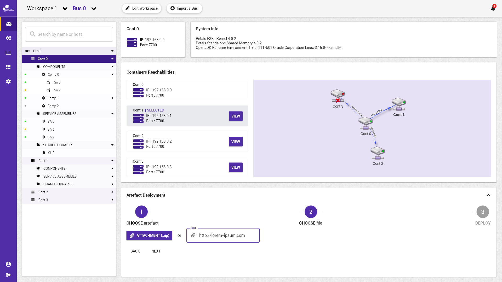
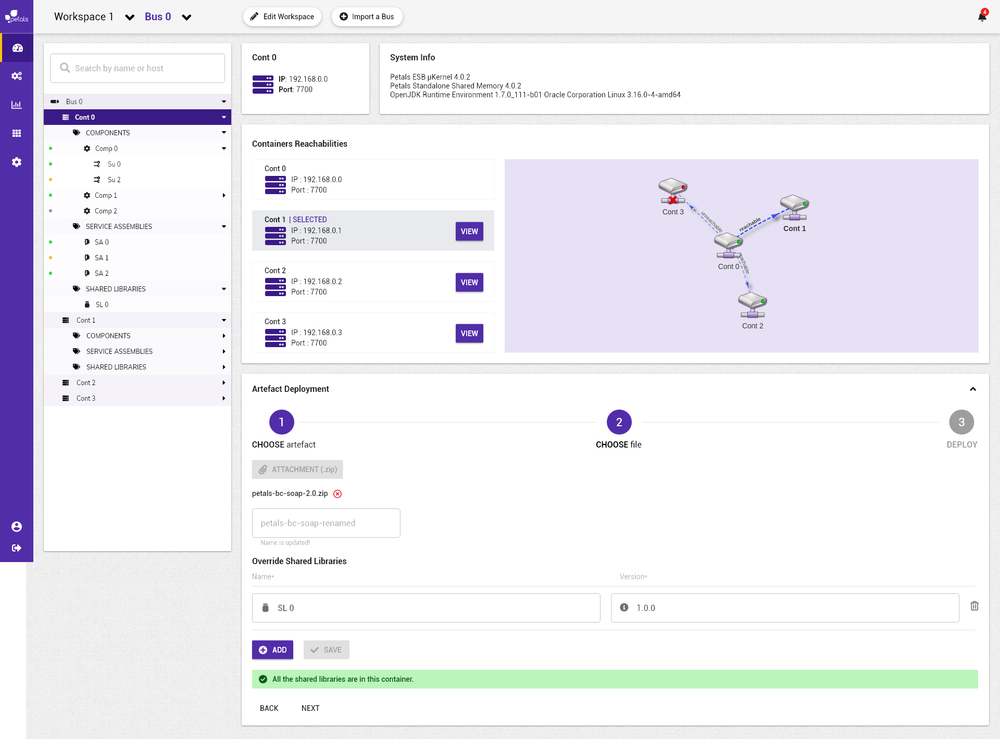

# Accéder au conteneur d'un nœud Petals


La notation suivante est prise :


* \[ tâche \] fait référence à une autre tâche.
* Action \(sans crochets\) fait référence à une action utilisateur.

Concepts associés : une **Topologie**, un **Nœud Petals**.  
Préconditions : [\[ Visualiser une Topologie \]](../topologie/visualiser-une-topologie.md)  
Postconditions : -  
Contraintes : -  
Complexité : -

