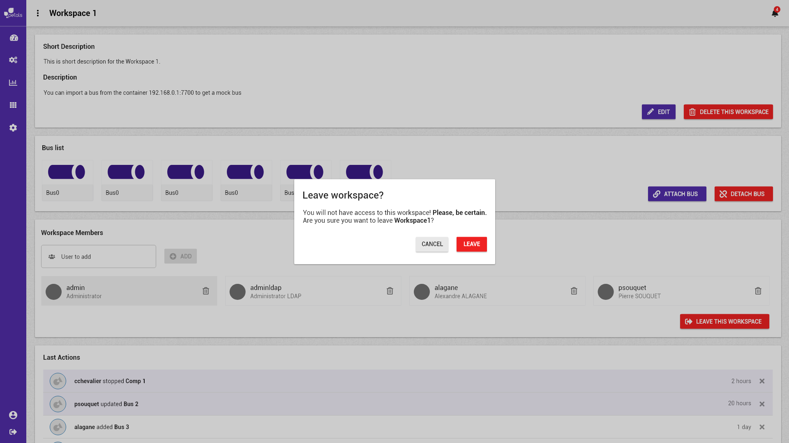

# Quitter le groupe de l'espace de travail


La notation suivante est prise :


* \[ tâche \] fait référence à une autre tâche.
* Action \(sans crochets\) fait référence à une action utilisateur.

Concepts associés : un **Espace de Travail**.  
Préconditions : [\[ Se Connecter \]](../espace-de-travail/se-connecter.md) [\[ Visualiser un espace de travail \]](../espace-de-travail/visualiser-un-espace-de-travail.md)  
Postconditions : [\[ Ouvrir un espace de travail \]](../espace-de-travail/charger-un-espace-de-travail.md)  
Contraintes : -  
Complexité : -


"Quitter le groupe" de l'espace de travail revient à se retirer les accès à l'espace de travail courant. A la fin de l'action, l'utilisateur ne fera plus partie des membres aillant accès à l'espace de travail.


### Scénario


Dans un scénario, on ne mentionne pas les actions techniques \(pas de clic, de tooltip, etc\).


**Scénario normal :** Albert ne veut plus avoir accès à l'espace de travail **prod.** Depuis la vue détail de l'espace en question, il se retire des membres aillant accès à l'espace après avoir confirmé. Il est déconnecté de l'espace de travail courant et est redirigé vers la page de sélection d'un espace de travail. Il n'aura plus accès à cette espace de travail.

### Maquettes

