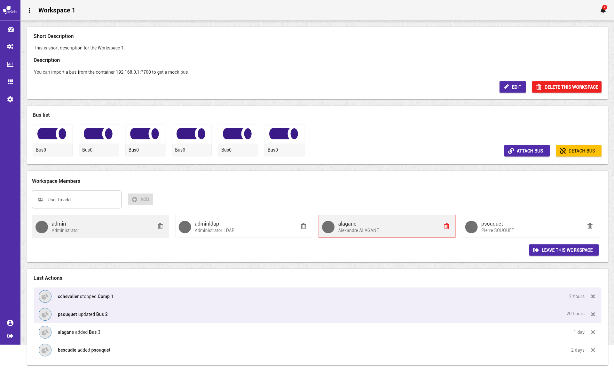
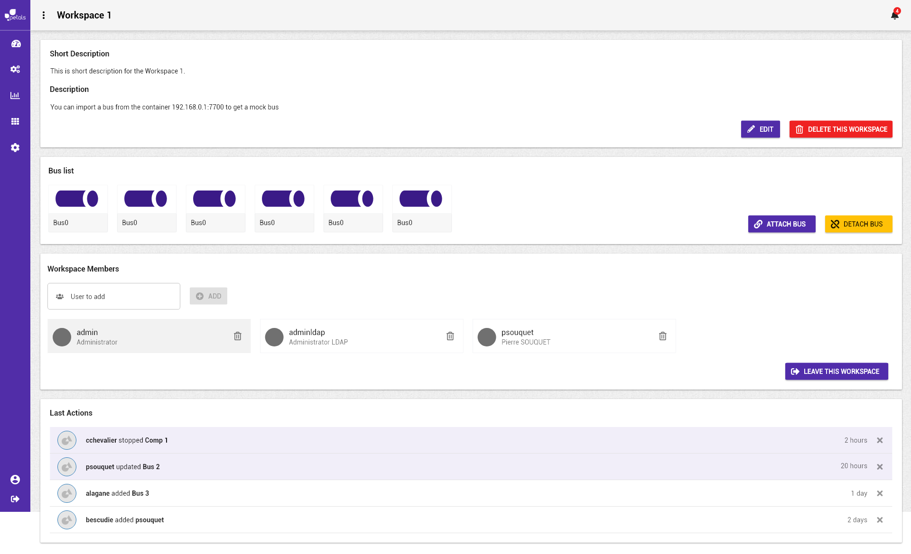

# Supprimer un utilisateur des membres de l'espace de travail


La notation suivante est prise :


* \[ tâche \] fait référence à une autre tâche.
* Action \(sans crochets\) fait référence à une action utilisateur.

Concepts associés : un **Espace de Travail**.  
Préconditions : [\[ Se Connecter \]](../espace-de-travail/se-connecter.md) [\[ Visualiser un espace de travail \]](../espace-de-travail/visualiser-un-espace-de-travail.md)  
Postconditions : -  
Contraintes : -  
Complexité : -

### Scénario


Dans un scénario, on ne mentionne pas les actions techniques \(pas de clic, de tooltip, etc\).


**Scénario normal :** Albert veut éditer les informations de l'espace de travail pour mettre à jour la liste des membres ayant accès à l'espace de travail. Il souhaite supprimer un membre. Il cherche le membre parmi la liste et le supprime à l'aide de l’icône de suppression. La liste est mise à jour lorsque l'utilisateur est supprimé de l'espace de travail.

### Maquettes

### Information complémentaire pour implémentation

* Il faut disposer des permissions suffisante pour pouvoir supprimer un membre de l'espace.

