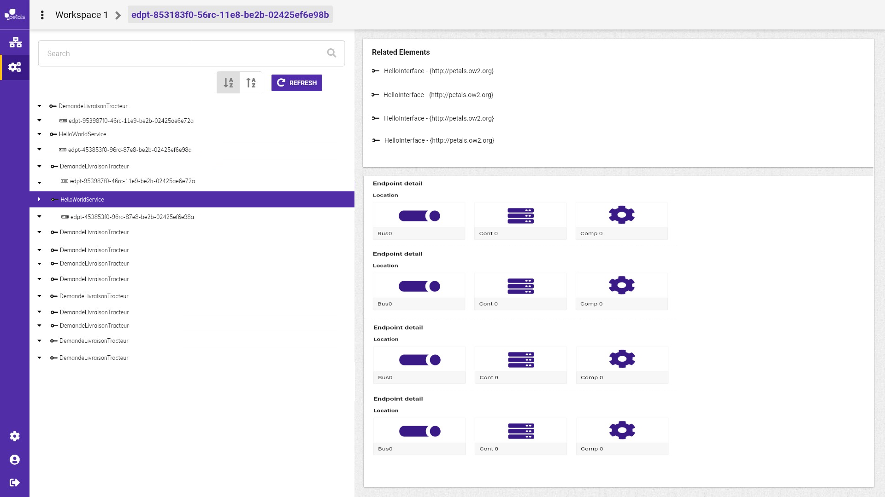

# change tree level

Par défaut, l'arbre permet de voir la liste des interfaces.  
Une fois l'interface sélectionner, il apparaît la liste des services qui lui sont associés.  
Lorsqu'on sélectionne un service, il apparaît le endpoint associé à ce service et cet interface.

L'utilisation du change tree level va permettre de descendre d'un niveau la hiérarchie de l'arbre. ainsi la liste des interfaces se trouvant au niveau 0 disparaît, laissant place à la liste des services. Il y aura une réorganisation de l'arbre car on souhaite afficher tous les endpoints liés aux services contrairement aux endpoints associés à une interface et un service.

le deuxième niveau du change tree level, va faire disparaître les services au niveau 0 et laisser place à la liste des endpoints. A la sélection de celui-ci, l'encadré détail laissera apparaître dans l'encadré related élément, l'interface et le service lui étant lié. Dans l'encadré détail endpoint, apparaîtra le bus, conteneur et composant lui étant associé.

