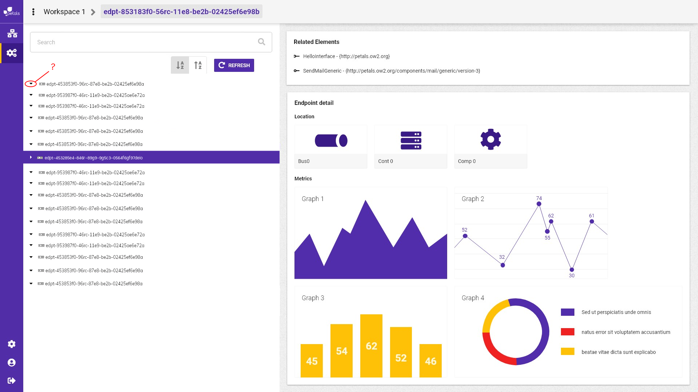

# Changer le niveau de l'arbre

Par défaut, l'arbre permet de voir la liste des interfaces. Changer de niveau permet de descendre d'un niveau la hiérarchie de l'arbre afin de n'afficher plus que services et endpoints, ou bien juste les endpoints. Il y aura donc 3 modes d'affichage

1. interfaces &gt; services &gt; endpoints
2. services &gt; endpoints
3. endpoints

Pour le mode 2 \(services &gt; endpoints\) il faudra faire attention à réorganiser de l'arbre car on souhaite afficher tous les endpoints liés a chaque services \(et non plus au couple interface+service\). Etant donné qu'un service peut être lié à plusieurs interfaces, un même service peut apparaître plusieurs fois dans l'arbre dans le mode 1, dans le mode 2 ce n'est plus possible.

Le visionnage du détail lorsque l'on clique sur un élément reste le même dans tous les modes.

