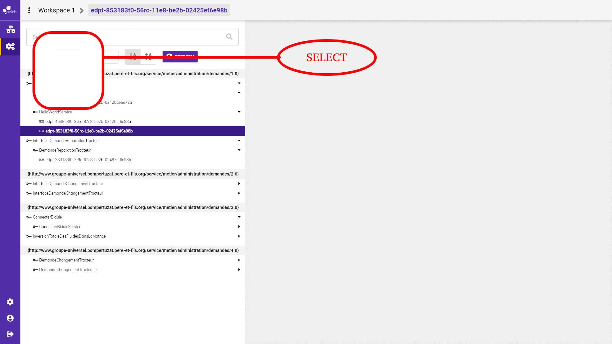

# Filtrer avec la barre de recherche et le système de tag

**Recherche élément via la barre de recherche :**  
Les résultats de l'arbre de service endpoint sont triés en fonction de ce que l'utilisateur inscrit dans la barre de recherche. Les éléments\( interfaces, services, endpoints\) de l'arbre se mettent à jour avec les résultats qui correspondent à la recherche.

**prochaine feature :**  
Un système de tag sera intégré à la barre de recherche.  
Lorsque la barre de recherche est sélectionnée, une liste déroulante appelé select apparaît, proposant plusieurs choix.   
Il existe deux solutions pour sélectionner un choix :  
Le premier consiste à cliquer sur un élément de la liste déroulante.  
Le deuxième consiste à écrire le choix du select commençant par un " : ".  
Exemple : " :interface ", sélectionne l'item interface de la liste déroulante.  
Une fois le choix sélectionné, celui-ci s'insère dans la barre de recherche. L'arbre est mis à jour et présente les résultats correspondant aux tags.  
En reprenant l'exemple de l'interface, l'arbre ne liste que les interfaces.   
A noter que plusieurs tags peuvent être entré dans la barre de recherche.  
Si l'utilisateur entre les tags interfaces et services, l'arbre affichera une liste d'interfaces et de services.  
  
**Combinaison des tags et de la recherche :**   
Si l'utilisateur a inscrit du texte dans la barre de recherche en plus du tag, l'arbre ne liste que les éléments correspondant aux tags et au texte inscrit dans la barre de recherche.  
  

  
_**liste des tags présents dans le select**_ **:**  
- Interface  
- Service  
- Endpoint  
- Namespace  
- Localpart  
- Bus  
- Composant  
- Conteneur


Maquette montrant le début d'une recherche



Maquette montrant le résultat d'une recherche.


