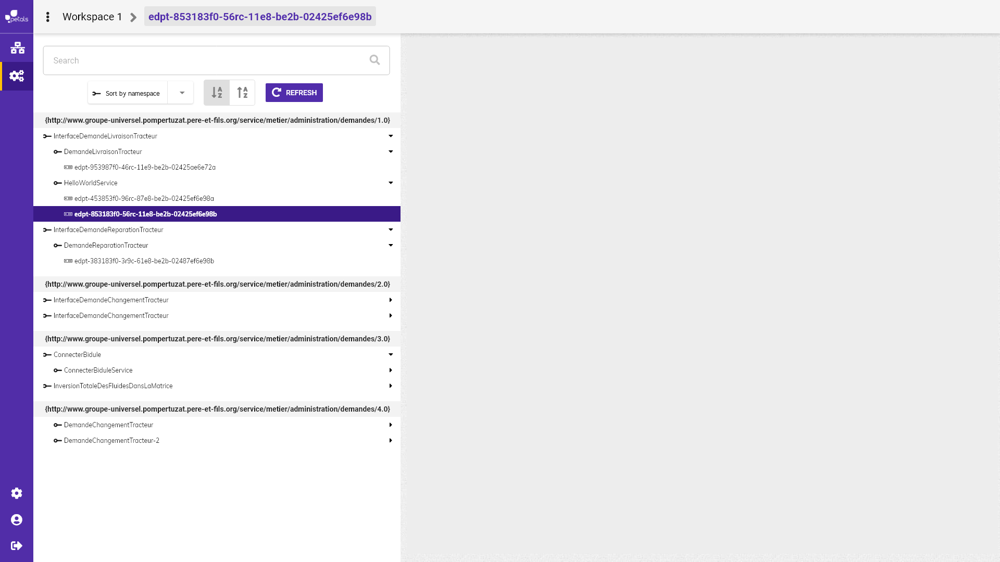

# Sort by element

L'utilisation du "sort by" permet de modifier l'ordre d'affichage de l'arbre du service endpoint.   
Exemple :   
"sort by" positionné sur interface, réorganise l'arbre de façon à afficher tous les services liés à une interface.   
"sort by" positionné sur service, réorganise l'arbre de façon à afficher toute les interfaces liés à un service. 


Maquette montrant le sort By positionné sur interface



Maquette montrant le sort By positionné sur service


