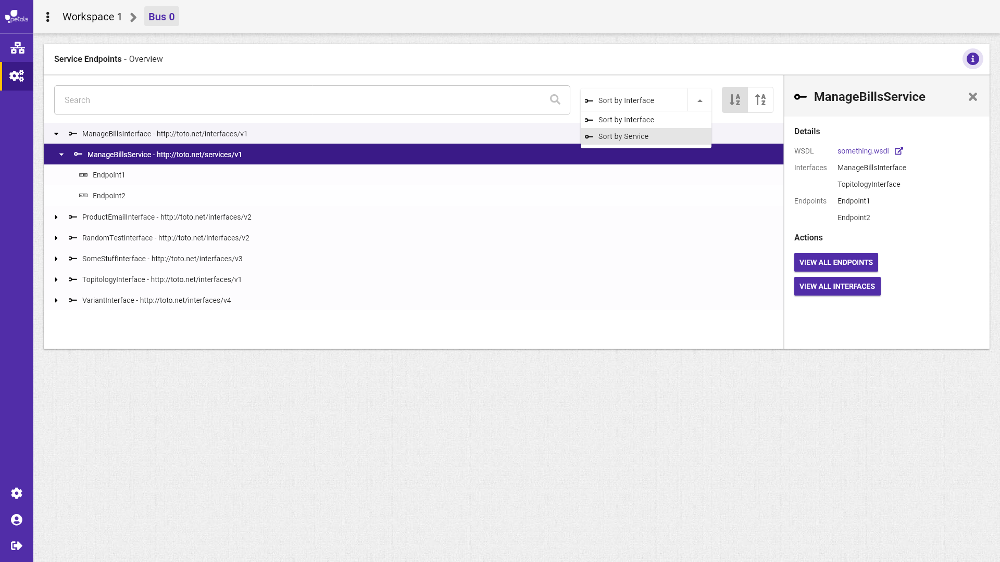

# Recherche et sélection d'un service

Scénario : Albert cherche un service. Pour se faire il se rend sur la barre de recherche et effectue sa recherche. La liste des services s'affichent s'il sélectionne au préalable de ne voir que les services.


La notation suivante est prise :


* \[ tâche \] fait référence à une autre tâche.
* Action \(sans crochets\) fait référence à une action utilisateur.

Concepts associés : une **Topologie**.  
Préconditions : -  
Postconditions : -  
Contraintes : -  
Complexité : -

Lorsque Albert sélectionne un service, un encadré détail apparaît listant les interfaces et les end-points qui lui sont rattachés. la liste des services présentes sous la barre de recherche reste inchangée.

