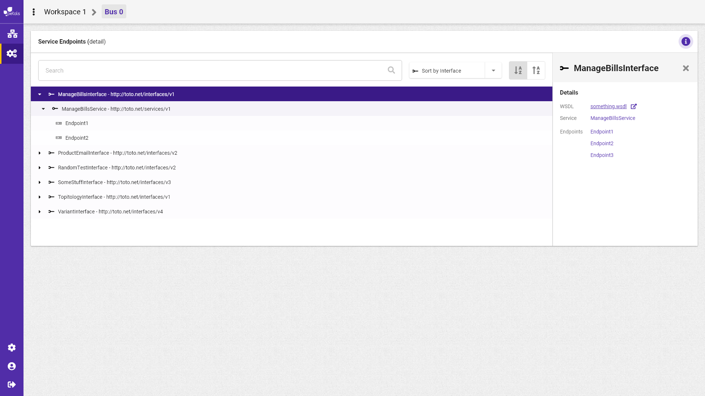

# Recherche et selection d'une interface

Scénario : Albert souhaite effectuer une recherche d'interface, il se rend sur la barre de recherche et effectue sa recherche. En premier lieu il sélectionne le sélect pour ne voir apparaître uniquement que les interfaces, ainsi la liste d'interfaces correspondant à sa recherche apparaît.


La notation suivante est prise :


* \[ tâche \] fait référence à une autre tâche.
* Action \(sans crochets\) fait référence à une action utilisateur.

Concepts associés : une **Topologie**.  
Préconditions : -  
Postconditions : -  
Contraintes : -  
Complexité : -

Lorsque Albert sélectionne une interface, un encadré détail apparaît listant les services et les end-points qui lui sont rattachés. la liste des interfaces présentes sous la barre de recherche reste inchangée.

