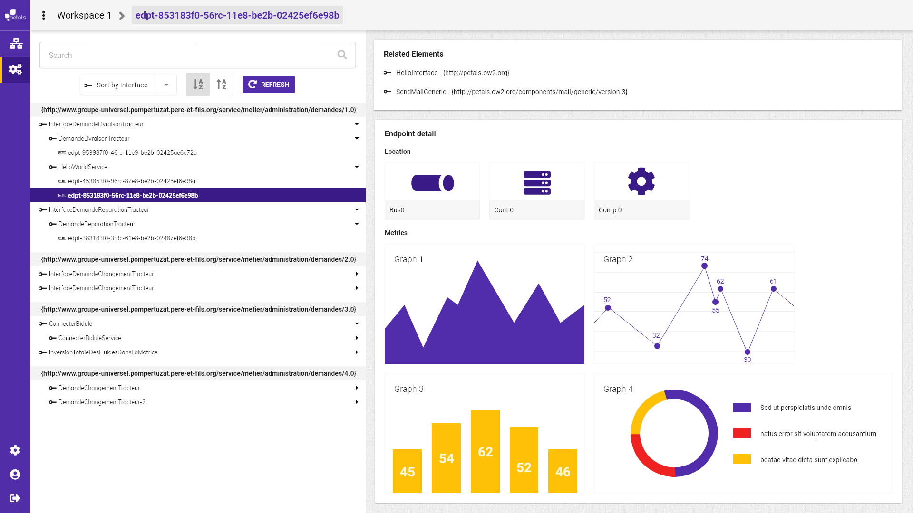

# Visualiser le détail d'un endpoint

Dans le détail du endpoint on retrouve les sections **related elements** et **endpoint detail.**   
**Related element:** liste le service et l'interface associée au endpoint.  
**Endpoint detail**: Montre les informations liés à la localisation du endpoint \(chacun est un lien de navigation\):

* Nom de son composant
* Conteneur sur lequel il tourne
* Bus sur lequel le conteneur tourne

