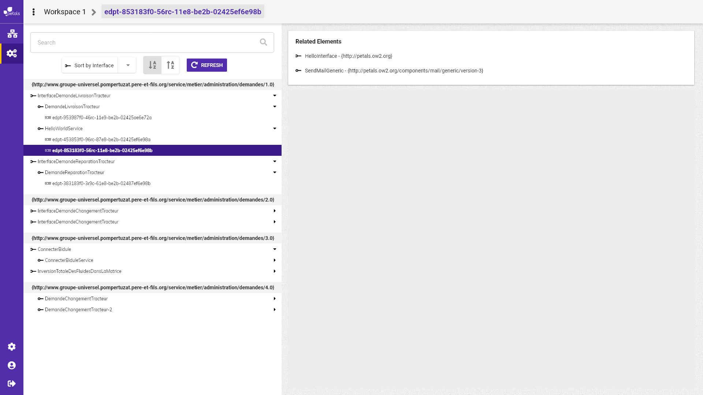

# Visualiser les services et les interfaces

Pour visualiser une interface ou un service, il faut sélectionner l'élément sur l'arbre de service endpoints. Un encadré "related element" se met à jour montrant les relations qu'il existe avec l'élément sélectionné.  
Un service dépend de une ou plusieurs interfaces.  
Une interface est lié à un ou plusieurs services.  
La liste des endpoints liés à une interface ou un services est également présente.

  


maquette Service ou interface sélectionné avec vue "related element".


