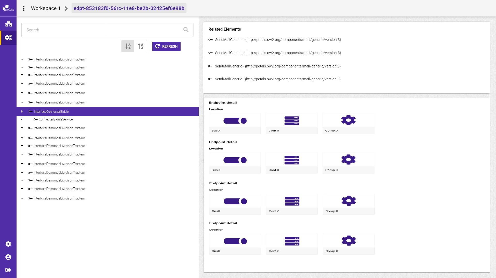

# Visualiser les services et les interfaces

Pour visualiser une interface ou un service, il faut sélectionner l'élément sur l'arbre de service endpoints. Un encadré "related element" se met à jour montrant les relations qu'il existe avec l'élément sélectionné sous forme de lien cliquable.   
Lors de la sélection d'une interface, la liste de tous les services lui étant associés apparaît das l'encadré related element, et la vue détails endpoint se met également à jour montrant tous les endpoints associés à cet interface et ses services qui lui sont associés.  
Lors de la sélection d'un service, la liste de toute les interfaces lui étant associés apparaît das l'encadré related element, et la vue détails endpoint se met également à jour montrant tous les endpoints associés à ce service et ses interfaces qui lui sont associés.

Lors du clic sur l'un de ces liens, l'utilisateur "navigue" dans l'arbre de service endpoint et se positionne sur l'élément sélectionné.  
Un service dépend de une ou plusieurs interfaces.  
Une interface est lié à un ou plusieurs services.  
La liste des endpoints liés à une interface ou un services est également présente.


maquette Service ou interface sélectionné avec vue "related element".


