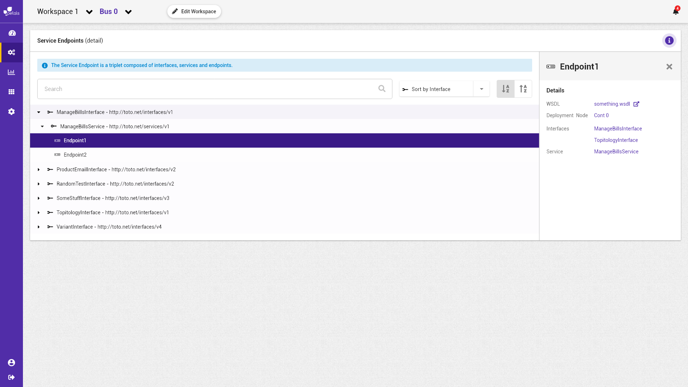

# Visualiser les services d'une topologie


La notation suivante est prise :


* \[ tâche \] fait référence à une autre tâche.
* Action \(sans crochets\) fait référence à une action utilisateur.

Concepts associés : une **Topologie**.  
Préconditions : -  
Postconditions : -  
Contraintes : -  
Complexité : -

