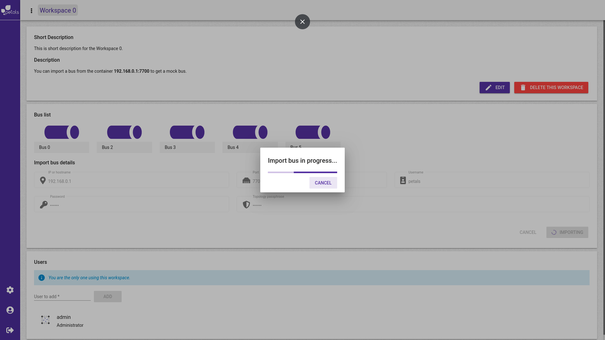

# Attacher une topologie


La notation suivante est prise :


* \[ tâche \] fait référence à une autre tâche.
* Action \(sans crochets\) fait référence à une action utilisateur.

Concepts associés : un **Espace de Travail**, une **Topologie**.  
Préconditions : [\[ Se Connecter \]](../espace-de-travail/se-connecter.md) [\[ Visualiser un espace de travail \]](../espace-de-travail/visualiser-un-espace-de-travail.md)  
Postconditions : -  
Contraintes : -  
Complexité : -

### Scénarios


Dans un scénario, on ne mentionne pas les actions techniques \(pas de clic, de tooltip, etc\).


**Scénario normal :** Albert veut attacher un bus à l'espace de travail courant. Il ajoute les informations pré-requises et **attache le bus**. Une barre de progression apparaît durant la phase d'importation du bus. Il ne peut pas modifier les informations pendant cette durée mais il peut toujours annuler son action s'il le souhaite. La liste est mise à jour lorsque le bus est attaché à l'espace de travail.

**Scénario alternatif 1 :** Albert veut attacher un bus à l'espace de travail courant. Il ajoute les informations pré-requises et **attache le bus**. Albert annule son importation, modifie les informations relative à l'importation \(champs pré-remplis\), puis attache le bus. Une barre de progression apparaît une nouvelle fois durant la phase d'importation du bus. La liste est mise à jour lorsque le bus est attaché à l'espace de travail.

**Scénario alternatif 2 :** Albert veut attacher un bus à l'espace de travail courant. Il ajoute les informations pré-requises et **attache le bus**. Une barre de progression apparaît durant la phase d'importation du bus. Malheureusement, un problème est survenu et l'importation échoue. Un message d'erreur apparâit. Albert peut modifier les informations \(si nécessaire\) puis relancer l'importation du bus. La liste est mise à jour lorsque le bus est attaché à l'espace de travail.

### Maquettes


Nous pourrions ajouter une option supplémentaire dans la phase d'importation d'un nouveau bus qui consiste à rediriger directement l'utilisateur sur la vue principale de la topologie importé avec succès.


