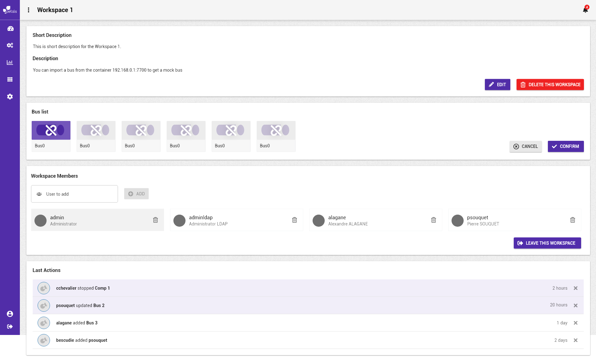
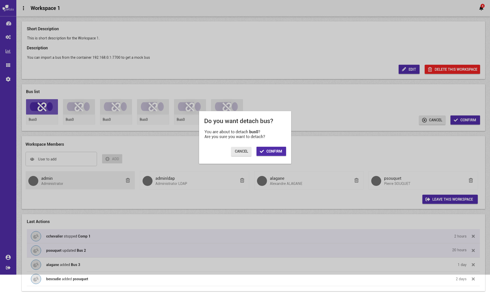

# Détacher une topologie


La notation suivante est prise :


* \[ tâche \] fait référence à une autre tâche.
* Action \(sans crochets\) fait référence à une action utilisateur.

Concepts associés : un **Espace de Travail**, une **Topologie**.  
Préconditions : [\[ Se Connecter \]](../espace-de-travail/se-connecter.md) [\[ Visualiser un espace de travail \]](../espace-de-travail/visualiser-un-espace-de-travail.md)  
Postconditions : -  
Contraintes : -  
Complexité : -

### Scénarios


Dans un scénario, on ne mentionne pas les actions techniques \(pas de clic, de tooltip, etc\).


**Scénario normal :** Albert veut détacher un bus de l'espace de travail courant. Il sélectionne le ou les bus qu'il souhaitent détacher et confirme son action. La liste est mise à jour lorsque le bus est détaché de l'espace de travail.

### Maquettes

