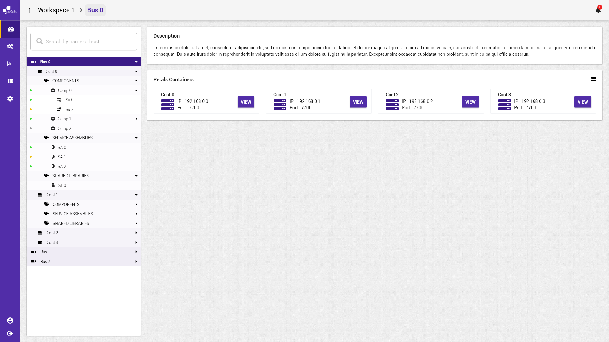

# Visualiser une topologie


La notation suivante est prise :


* \[ tâche \] fait référence à une autre tâche.
* Action \(sans crochets\) fait référence à une action utilisateur.

Concepts associés : un **Espace de Travail**, une **Topologie**.  
Préconditions : [\[ Se Connecter \]](../espace-de-travail/se-connecter.md) [\[ Charger un Espace de Travail \]](visualiser-une-topologie.md)  
Postconditions : -  
Contraintes : -  
Complexité : -

### Scénarios


Dans un scénario, on ne mentionne pas les actions techniques \(pas de clic, de tooltip, etc\).


**Scénario normal :** Albert veut consulter les informations du bus sélectionné. La description du bus sélectionné ainsi que la liste des conteneurs existants sur ce bus sont visible. Sur chaque conteneur, il voit son **IP** et son **Port**. Albert sélectionne le conteneur sur lequel il veut se rendre pour avoir plus d'informations.

### Maquettes

### Informations complémentaires pour implémentation


Le champ **description** n'existe pas à l'heure actuelle. \(La derscription est présente dans le frontend mais toujours vide, il n'y a pas de champ correspondant dans la DB\). Faut-il ajouter la feature description aux bus ou supprime-t-on cette description ? 


* La liste des conteneurs est triée par ordre alphabétique.

Pour visualiser une topologie, l'utilisateur peut :

* Le sélectionner depuis la vue[ \[ Visualiser un espace de travail \]](../espace-de-travail/visualiser-un-espace-de-travail.md) en sélectionnant le bus dans la liste.
* Le sélectionner depuis la vue [\[Sélectionner une topologie\]](selectionner-une-topologie.md) en sélectionnant le bus dans l'arbre.
* Lorsqu'il est connecté à son espace de travail, cliquer sur le nom du bus sélectionné qui apparaît dans le "**fil d'ariane**".


Le nom du bus sélectionné est visible dans le "**fil d'ariane**" précédé du nom de l'espace de travail. Il apparaît également dans les vues enfants \(conteneur, composant, ...\) en tant que premier enfant du "**fil d'ariane**".


